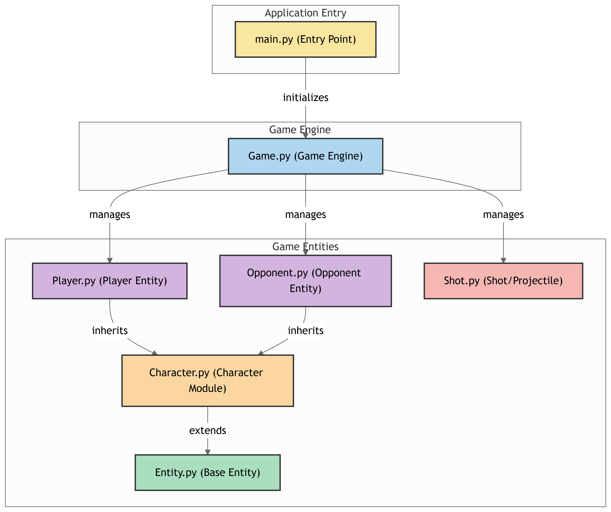

# Tarea 24-25
https://github.com/Tomas-Dorado/Tarea_24-25.git

Este proyecto es un juego básico implementado en Python, que incluye clases para representar jugadores, enemigos, disparos y la lógica principal del juego.

## Estructura del Proyecto

El proyecto está organizado en los siguientes archivos:

- **`Entity.py`**: Clase base para todos los elementos del juego.
- **`Character.py`**: Clase base para personajes con vida, como jugadores y enemigos.
- **`Player.py`**: Clase que representa al jugador principal.
- **`Opponent.py`**: Clase que representa a los enemigos.
- **`Boss.py`**: Clase que representa al jefe final.
- **`Shot.py`**: Clase que representa los disparos.
- **`Game.py`**: Clase principal que gestiona la lógica del juego.
- **`main.py`**: Archivo principal para ejecutar el juego.
- **`diagram.png`**: Diagrama que ilustra la relación entre las clases.

## Diagrama de Clases

A continuación se muestra un diagrama que representa la relación entre las clases del proyecto:



## Cómo Ejecutar el Juego

1. Asegúrate de tener Python 3 instalado en tu sistema.
2. Clona este repositorio o descarga los archivos.
3. Ejecuta el archivo `main.py` desde la terminal:

   ```bash
   python main.py

